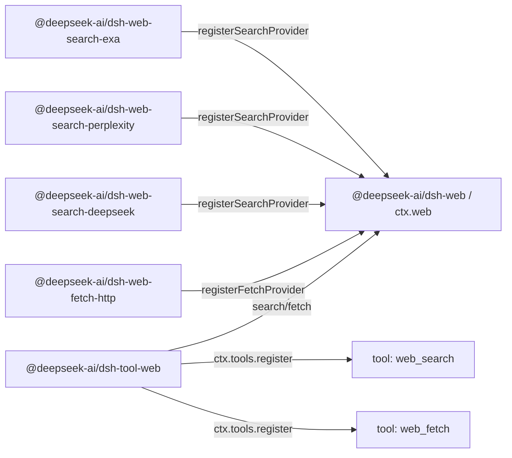

# Agent Note: Web seam de capacidad — herramientas estables sobre múltiples providers

Status: implemented

[English](2026-06-24-web-capability-seam.md) | Español

## Problema

El harness necesita herramientas web orientadas al modelo sin atar el contrato del modelo a la forma de API de un único proveedor. La búsqueda es el punto de presión inmediato: admitir desde el principio tanto la búsqueda de Exa como la de Perplexity — dos formas de provider deliberadamente distintas (Exa devuelve un `results[]` plano de `{title, url, highlights, publishedDate}`; Perplexity devuelve una respuesta generada más citas) — es lo que demuestra que el contrato web normalizado no se limita a reflejar a un único proveedor. El fetch es una operación aparte: un backend de fetch HTTP(S) público anónimo plantea preocupaciones de transporte, seguridad, redirecciones, decodificación y límites de tamaño que no son las mismas que las de la búsqueda respaldada por providers.

La API orientada al modelo debe permanecer estable mientras los backends cambian. Un cambio de provider de búsqueda no debería cambiar cómo pide el modelo una consulta, y un cambio de implementación de fetch no debería cambiar cómo pide el modelo una URL. A la inversa, un paquete de provider no debería exponer su propio schema de herramienta orientado al modelo solo porque tiene controles adicionales específicos del provider.

Poner la búsqueda y el fetch directamente en `dsh-tool-web` haría que la herramienta orientada al modelo fuera dueña a la vez de la selección de provider, del mapeo de solicitudes del backend, de la política de transporte, de la normalización de resultados, de la guía de prompt, de la presentación y del registro del schema. Dejar que cada provider registre su propia herramienta tiene el problema opuesto: la disponibilidad, los nombres, las descripciones y los parámetros de las herramientas dependerían de qué paquetes de provider resulten cargados, y los campos específicos del provider se filtrarían al contrato del modelo.

También está la cuestión de la selección de provider. Los `tool-bash` y `tool-fs` existentes pueden apoyarse en el `inject` de Cordis porque hay una única clave de servicio de backend. Web tiene dos capacidades independientes (`search` y `fetch`) y potencialmente varios providers por capacidad. `inject: ['web']` demuestra que el seam existe; no demuestra que exista un provider de búsqueda o de fetch utilizable, y no define qué provider debe ganar cuando hay varios registrados.

## Decisión

El acceso web es un seam de capacidad de primera clase que sigue [la Agent Note de seams de capacidad](2026-06-13-capability-seams.es.md):

1. `@deepseek-ai/dsh-web` (`packages/web/web`) posee `ctx.web`, el registro de providers, la selección de providers, el vocabulario compartido de solicitudes/resultados y los errores específicos de web.
2. Los paquetes de provider implementan backends concretos y registran capacidades con `ctx.web`, por ejemplo `@deepseek-ai/dsh-web-search-exa`, `@deepseek-ai/dsh-web-search-perplexity`, `@deepseek-ai/dsh-web-search-deepseek` y `@deepseek-ai/dsh-web-fetch-http`.
3. `@deepseek-ai/dsh-tool-web` (`packages/web/tool-web`) posee los schemas de herramienta `web_search` y `web_fetch` orientados al modelo, las secciones de prompt, la validación de argumentos, el formato de los resultados y la presentación propiedad de la herramienta sobre `ctx.web`.

Los providers no registran herramientas. Los providers registran capacidades. `dsh-tool-web` es el único dueño de los nombres, las descripciones, la guía de prompt, los schemas JSON y la presentación orientados al modelo.

La búsqueda y el fetch son herramientas separadas pero un único seam de acceso web. `ctx.web` posee la selección de providers, el vocabulario de abort/error y la configuración de despliegue de ambos registros paralelos. Sus schemas de solicitud y su lógica de provider permanecen separados; el servicio compartido es la frontera de producto para llegar a la web.

`dsh-tool-web` registra las herramientas web orientadas al modelo cuando el producto ha habilitado esas herramientas y el seam `ctx.web` está presente. La disponibilidad del backend es una preocupación del momento de ejecución, no del registro del schema:

- `web_search` se registra cuando la búsqueda web está habilitada para el producto/aplicación, y `web_fetch` cuando lo está el fetch web.
- Una herramienta nunca se desregistra solo porque su provider seleccionado falte, esté mal configurado, carezca de credenciales, sea ambiguo o esté temporalmente no disponible.
- El provider se resuelve en tiempo de ejecución, y se devuelve un `WebError` estructurado cuando la capacidad seleccionada no puede ejecutarse.

Esto mantiene estable el schema del modelo sin hacer del orden de carga de plugins, del estado de las credenciales o del momento del HMR parte del contrato orientado al modelo. Si la búsqueda web está habilitada pero no existe ningún provider de búsqueda utilizable, `web_search` permanece visible y la ejecución falla con un `WebError` estructurado como `WEB_PROVIDER_UNAVAILABLE` o `WEB_PROVIDER_CONFIGURED_UNAVAILABLE`. Si aparece un provider después de `dsh-tool-web`, la siguiente ejecución puede usarlo sin cambiar el schema. Si un provider desaparece a mitad de la llamada, la ejecución falla con un `WebError` estructurado en lugar de elegir silenciosamente otro provider o caer en `UNKNOWN_TOOL`.

El seam no expone deliberadamente ninguna superficie de observación — ni evento de cambio de registro ni consulta agregada de estado de capacidad. La indisponibilidad es un hecho que el llamador observa ejecutando: `search()`/`fetch()` resuelven el provider en el momento de la llamada y lanzan el `WebError` estructurado que nombra lo que falló. [La Agent Note de la superficie de observación](../../archived/simplification/2026-07-04-drop-unconsumed-web-observation-surface.md) registra ese juicio: la selección derivada en la llamada y el registro basado en la habilitación no dejan ningún Consumer que necesite una señal de cambio o una sonda de disponibilidad distinta de ejecutar y enrutar el error, y un futuro panel de estado de providers reintroduce la señal o la consulta más pequeña que realmente consuma.

## Topología de paquetes

La división tripaquete Service Definition / Service Provider / Consumer sigue a bash y filesystem, pero el paquete de *interfaz* está más cerca del seam de LLM. `LlmRuntime` (`packages/llm/llm/src/index.ts`) es un registro de providers indexado por nombre: `registerAdapter(models, adapter)` almacena los adaptadores en un `Map`, devuelve un disposer, lanza `DUPLICATE_ADAPTER` con claves duplicadas y lanza `NO_ADAPTER` en el momento de la resolución. `ctx.web` sigue esa forma de registro, pero tiene dos tipos de capacidad y una política de selección más rica (un id de provider configurado, o auto-selección cuando hay registrado exactamente un provider utilizable), de modo que el `WebError` que lanza una ejecución puede explicar por qué una capacidad de búsqueda o de fetch no puede ejecutarse.

La dirección de las dependencias refleja la de bash y filesystem:

```text
@deepseek-ai/dsh-tool-web  --depends on-->  @deepseek-ai/dsh-web  <--depends on--  @deepseek-ai/dsh-web-search-exa
        consumer                                 interface                       implementation
                                                                 <--depends on--  @deepseek-ai/dsh-web-search-perplexity
                                                                                  implementation
                                                                 <--depends on--  @deepseek-ai/dsh-web-search-deepseek
                                                                                  implementation
                                                                 <--depends on--  @deepseek-ai/dsh-web-fetch-http
                                                                                  implementation
```

En tiempo de ejecución, los paquetes de provider registran capacidades con `ctx.web`; `tool-web` registra herramientas estables con `ctx.tools` y ejecuta a través del seam:



`@deepseek-ai/dsh-web` depende solo de Cordis y del soporte de bajo nivel del harness. Declara `ctx.web`, las interfaces de provider, los tipos de solicitud/resultado, el contrato de disponibilidad de providers y los códigos de error. No importa paquetes de herramienta, agent, sesión, LLM ni de provider.

Los paquetes de provider dependen solo de `dsh-web` y de Cordis. Poseen las credenciales, los endpoints, el mapeo de wire, el parsing y la traducción a `WebError`, usando el `fetch` de la plataforma. Cada provider inyecta el servicio compartido y registra un backend; solo `dsh-web` posee la clave `ctx.web`. Las formas de protocolo privadas de cada provider no crean dependencias de `ctx.llm` ni de un servicio HTTP de Cordis.

`@deepseek-ai/dsh-tool-web` depende de `@deepseek-ai/dsh-web`, `@deepseek-ai/dsh-tools`, `@deepseek-ai/dsh-system-prompt` y de Cordis. Nunca importa paquetes de provider concretos.

## Contrato de `ctx.web`

`ctx.web` es un registro de providers más una API de ejecución que selecciona el provider. La mitad de registro permanece cerca de `LlmRuntime`: un `Map<id, provider>` por tipo de capacidad, métodos `registerSearchProvider` / `registerFetchProvider` que devuelven disposers, ids duplicados que lanzan `WebError` y una resolución en tiempo de ejecución que lanza cuando el provider seleccionado está ausente o no es utilizable. Las firmas de autoridad viven en `packages/web/web/src/types.ts`; la forma del seam:

```ts
import type { WebFetchRequest, WebFetchResult, WebSearchRequest, WebSearchResult } from '@deepseek-ai/dsh-web'

interface WebSearchProvider {
  readonly id: string
  available(): boolean
  search(request: WebSearchRequest, signal?: AbortSignal): Promise<WebSearchResult>
}

interface WebFetchProvider {
  readonly id: string
  available(): boolean
  fetch(request: WebFetchRequest, signal?: AbortSignal): Promise<WebFetchResult>
}

interface WebRuntime {
  registerSearchProvider(provider: WebSearchProvider): () => void
  registerFetchProvider(provider: WebFetchProvider): () => void

  search(request: WebSearchRequest, signal?: AbortSignal): Promise<WebSearchResult>
  fetch(request: WebFetchRequest, signal?: AbortSignal): Promise<WebFetchResult>
}
```

La señal opcional es control de ejecución, no entrada de negocio: `tool-web` pasa `exec.signal` directamente para que la cancelación del turno, el timeout de la herramienta y el disposal del agent lleguen a las solicitudes de red del provider, a los lectores de stream y a la decodificación costosa. El seam no transmite `ToolExecution` — eso haría que `dsh-web` dependiera de `dsh-tools`.

Los ids de provider son cadenas estables y únicas dentro de su tipo de capacidad. Registrar un id de provider de búsqueda duplicado o un id de provider de fetch duplicado falla en lugar de reemplazar silenciosamente al provider antiguo. El registro de un provider devuelve un disposer y sigue el patrón existente de `ctx.tools.register()` / `ctx.systemPrompt.section()`: la mutación se envuelve en `ctx.effect()` para que el registro se desmonte junto con la fibra que contribuyó.

## Disponibilidad de providers y selección

La disponibilidad de los providers y la selección de capacidad son conceptos separados, pero ambos se mantienen mínimos. Un provider informa solo de si esa implementación concreta es utilizable mediante comprobaciones locales baratas, como la presencia de credenciales o una configuración de endpoint parseable. El `available()` de un provider no debe hacer llamadas de red.

`LlmRuntime` no tiene ningún tipo de estado: la disponibilidad se expresa como pertenencia al registro más un throw en el momento de la resolución. `ctx.web` sigue la misma disciplina. El seam no expone ninguna consulta agregada de estado de capacidad — `search()` / `fetch()` derivan la selección en cada llamada a partir del id de provider configurado, de los providers registrados y del booleano local y barato `available()` de cada provider, y un fallo de selección es el `WebError` estructurado que se lanza en tiempo de ejecución. Un llamador que necesite saber si una capacidad puede ejecutarse ejecuta y enruta ese error; nada se almacena como estado de servicio mutable.

El booleano es una entrada de la selección, no un sistema de salud. `tool-web` nunca llama directamente al `available()` de un provider — su única vía hacia el seam es `search()` / `fetch()` — de modo que la política de selección tiene un único dueño.

La selección no debe depender del orden de registro. El orden de carga de Cordis, el orden de la configuración y el momento del HMR no son semántica de producto.

| Situación | Comportamiento de ejecución |
|---|---|
| Hay registrado un id de provider configurado y `available() === true` | ejecuta ese provider |
| No está registrado el id de provider configurado | falla con `WEB_PROVIDER_CONFIGURED_MISSING` |
| El id de provider configurado está registrado pero no disponible | falla con `WEB_PROVIDER_CONFIGURED_UNAVAILABLE` |
| No hay ningún id de provider configurado y hay registrado y disponible exactamente un provider de ese tipo | ejecuta ese único provider |
| No hay ningún id de provider configurado y no hay ningún provider de ese tipo registrado | falla con `WEB_PROVIDER_UNAVAILABLE` |
| No hay ningún id de provider configurado y hay registrados varios providers utilizables de ese tipo | falla con `WEB_PROVIDER_AMBIGUOUS` en lugar de elegir por orden de registro |
| No hay ningún id de provider configurado y existen providers pero ninguno es utilizable | falla con `WEB_PROVIDER_UNAVAILABLE` |

La regla de «auto-selección con un único provider» es para pruebas, demos y despliegues sencillos. Las configuraciones de producto fijan ids de provider explícitos:

```yaml
- id: web
  name: '@deepseek-ai/dsh-web'
  config:
    searchProvider: exa
    fetchProvider: http

- id: web-search-exa
  name: '@deepseek-ai/dsh-web-search-exa'

- id: web-search-perplexity
  name: '@deepseek-ai/dsh-web-search-perplexity'

- id: web-search-deepseek
  name: '@deepseek-ai/dsh-web-search-deepseek'

- id: web-fetch-http
  name: '@deepseek-ai/dsh-web-fetch-http'

- id: tool-web
  name: '@deepseek-ai/dsh-tool-web'
```

Los overrides operativos alimentan la misma vía de selección explícita: `DSH_WEB_SEARCH_PROVIDER=perplexity` equivale a la configuración `searchProvider: perplexity`, no a una cadena de prioridad oculta dentro de `dsh-tool-web`.

`ctx.web.search()` y `ctx.web.fetch()` resuelven el provider en tiempo de ejecución usando las reglas de selección anteriores. Si la capacidad seleccionada no está disponible, lanzan `WebError` con un código estructurado como `WEB_PROVIDER_UNAVAILABLE`, `WEB_PROVIDER_CONFIGURED_MISSING`, `WEB_PROVIDER_CONFIGURED_UNAVAILABLE` o `WEB_PROVIDER_AMBIGUOUS`. Si no hay ningún provider configurado explícitamente y no existe ningún provider utilizable, el error de ejecución es el caso genérico `WEB_PROVIDER_UNAVAILABLE`; deliberadamente no existe ningún resumen diagnóstico de cada provider no disponible.

## Schema de solicitud y resultado de búsqueda

La herramienta `web_search` orientada al modelo es pequeña. El único argumento orientado al modelo es:

- `query`: cadena obligatoria.

`max_results` NO se expone al modelo. Es una decisión de la capa de `dsh-tool-web`: la herramienta fija el límite de resultados — la configuración de plugin `searchMaxResults`, con valor por defecto `8` (alineado con el valor por defecto de Exa en OpenCode), reflejando el `readLimit` de `dsh-tool-fs` — y lo pasa al seam como `maxResults` en la `WebSearchRequest`. Mantenerlo fuera del schema del modelo significa que el modelo solo hace una pregunta y el producto controla cuánto contexto vuelve; el campo puede promoverse más tarde a argumento orientado al modelo sin romper el seam.

`maxResults` fluye herramienta → seam → provider, y el límite se aplica en el camino de vuelta:

- `dsh-tool-web` posee el valor y lo pone en `WebSearchRequest.maxResults`.
- `ctx.web` transmite la solicitud sin cambios al provider seleccionado.
- Un provider aplica `maxResults` en la capa de solicitud cuando su API lo admite (el `numResults` de Exa), como optimización de coste/latencia.
- `ctx.web` aplica el límite sobre el resultado: si un provider devuelve más de `maxResults` fuentes — porque su API no tiene control del número de resultados (Perplexity) o ignoró la indicación — el seam trunca `sources[]` a `maxResults` y pone `WebSearchResult.truncated` a `true` antes de devolver. Esto convierte el límite en una única garantía transversal entre providers en la que la capa orientada al modelo puede confiar, en lugar de algo que cada provider deba recordar cumplir.

La solicitud del seam no lleva controles específicos del provider — ni selección de modelo de Perplexity, ni actualidad de búsqueda, ni filtros de dominio, ni `livecrawl` de Exa, ni `type` de Exa, ni indicaciones regionales, ni presupuestos de respuesta generada, ni profundidad de búsqueda. Un campo así solo se añade cuando tiene semántica neutral entre providers que tanto el schema de la herramienta como los providers seleccionados puedan cumplir honestamente.

```ts
interface WebSearchRequest {
  readonly query: string
  /** Upper bound on returned sources; the seam truncates to it. Omitted = no bound. `dsh-tool-web` always sets it. */
  readonly maxResults?: number
}

interface WebSearchResult {
  readonly content?: string
  readonly sources: readonly WebSearchSource[]
  readonly truncated: boolean
}

interface WebSearchSource {
  readonly url: string
  readonly title?: string
  readonly snippet?: string
  readonly publishedAt?: string
}
```

`content` es el texto opcional de respuesta generada por el provider, el contexto de búsqueda o un resumen. `sources[]` es la forma de cita portable. Una fuente siempre tiene una URL; title, snippet y `publishedAt` son opcionales porque no todos los providers los devuelven. `title` no es obligatorio: las citas al estilo Perplexity pueden aportar solo URLs, y obligar a los adaptadores a inventar títulos haría mentir al seam. `dsh-tool-web` renderiza una etiqueta de respaldo (fallback) al estilo `title ?? hostname(url)` para la visualización. `publishedAt` es una marca de tiempo opcional de publicación/rastreo como cadena ISO-8601 — Exa la devuelve como `publishedDate` en cada resultado y Perplexity devuelve un `date` en los resultados de búsqueda, de modo que son datos reales del provider, no derivados; el seam la transporta como cadena y deja el parsing de fechas al Consumer.

La búsqueda de Exa mapea cada entrada del `results[]` plano del provider a una `WebSearchSource`: `url` ← `url`, `title` ← `title`, `snippet` ← la primera entrada de `highlights[]` (una entrada sin highlight no tiene snippet portable y se descarta), `publishedAt` ← `publishedDate`. Exa no devuelve ninguna respuesta generada por el provider, así que `content` se omite. La búsqueda de Perplexity mapea `choices[0].message.content` a `content` y prefiere el `search_results[]` estructurado de nivel superior para `sources[]` — `url` ← `url`, `title` ← `title`, `snippet` ← `snippet` (a menudo vacío), `publishedAt` ← `date` — recurriendo al array `citations[]` solo con URLs únicamente cuando falta `search_results` (esas fuentes llevan solo un `url`). Si un provider devuelve menos campos estructurados de los que el seam admite, el adaptador omite esos campos opcionales.

La recuperación de la página completa sigue siendo tarea de `web_fetch(url)`. Los snippets de búsqueda son contexto de descubrimiento, no cuerpos de página obtenidos.

## Schema de solicitud y resultado de fetch

La implementación de `web_fetch` es un provider de fetch HTTP(S) público anónimo, `http`. Obtiene bytes de una URL concreta, aplica la higiene de transporte básica siguiente (solo http/https, rechazo de credenciales, límites de bytes/tiempo, bloqueo de redirecciones entre orígenes), decodifica el contenido textual y devuelve solo el resultado mínimo útil para el modelo: URL final, código de estado, cuerpo y truncamiento. No lleva cookies de navegador, credenciales de editor, credenciales de git, tokens de autenticación internos ni acceso implícito a servicios privados. (El bloqueo completo de SSRF / redes privadas está diferido — ver [Trabajo diferido](#deferred-work)).

La solicitud del seam sigue siendo más pequeña que la herramienta orientada al modelo de OpenCode:

- `url`: URL HTTP(S) obligatoria.

La solicitud del seam no incluye deliberadamente un timeout por llamada, ni `format`, ni `prompt`, ni controles de extracción específicos del provider. La cancelación es la señal de ejecución opcional directa, mientras que el provider de fetch posee un backstop de timeout configurado en el despliegue. `format` es una decisión de presentación sobre un recurso obtenido; `prompt` es una instrucción de resumen de LLM de nivel superior; las APIs de extracción como Firecrawl, Exa, Tavily o Parallel pueden no exponer una respuesta HTTP concreta. Si el producto necesita más tarde extracción de páginas respaldada por providers, eso es una capacidad `web_extract` aparte o una ampliación deliberada de este seam — la semántica de extracción nunca se cuela en `web_fetch` haciendo opcional cada campo HTTP.

El estado HTTP es parte del estado del recurso obtenido, no automáticamente un fallo de herramienta. Un fetch de red correcto de una respuesta `404` o `500` devuelve `WebFetchResult` con el código de estado y un cuerpo decodificado acotado cuando el tipo de contenido está soportado. `WebError` es para los fallos al recuperar o representar el recurso con seguridad: URL inválida o bloqueada, violación de la política de redirecciones, timeout, abort, respuesta demasiado grande, tipo de contenido no soportado, fallo del provider o fallo de red.

```ts
export interface WebFetchRequest {
  readonly url: string
}

export interface WebFetchResult {
  readonly url: string
  readonly statusCode: number
  readonly body: WebFetchBody
  readonly truncated: boolean
}

export type WebFetchBody =
  | { readonly kind: 'html'; readonly content: string }
  | { readonly kind: 'text'; readonly content: string }
```

`WebFetchResult.url` es la URL final tras las redirecciones permitidas. La URL de la solicitud ya está presente en `WebFetchRequest`, así que no existe un par separado `requestedUrl`/`finalUrl`.

`WebFetchBody` es una unión discriminada cerrada porque los tipos de cuerpo requieren cambios coordinados en el seam, el provider y la herramienta en lugar de una extensión independiente de plugin. Los switch exhaustivos hacen que un tipo nuevo falle la compilación en cada renderizador hasta que se maneje. Los brazos de objeto separados dejan sitio para campos específicos del tipo.

El provider posee la recuperación segura del recurso: validación de URL, transporte HTTP, política de redirecciones, timeout, propagación del abort, límites de bytes, decodificación del juego de caracteres, clasificación del tipo de contenido y rechazo de binarios. `dsh-tool-web` posee la presentación: HTML a markdown, HTML a texto, el formato de truncamiento para el modelo y los futuros resúmenes.

Los controles de recurso del provider de fetch:

- Solo se aceptan URLs `http:` y `https:`; las credenciales en las URLs se rechazan.
- Se aplican la longitud máxima de URL, el límite de bytes de la respuesta, el límite de caracteres del cuerpo decodificado, el timeout y el límite de saltos de redirección.
- Las señales de abort se propagan a través de los fetches de red y de la decodificación costosa.
- Solo se siguen automáticamente las redirecciones del mismo origen; una redirección entre orígenes falla con `WEB_REDIRECT_BLOCKED`, exigiendo una nueva llamada de herramienta y, por tanto, una nueva decisión de provider/permiso. (El WebFetch de Claude Code usa este mismo modelo — no sigue automáticamente una redirección entre hosts; devuelve el destino de la redirección al modelo para una nueva llamada.)
- Las solicitudes llevan un user agent de producto explícito en lugar de suplantar silenciosamente a un navegador.

La protección SSRF / redes privadas (bloquear los destinos privados, loopback, link-local, multicast y, en general, no públicos, con resolución DNS y validación posterior para vencer el rebinding y con revalidación por salto en las redirecciones) está **diferida** — ver [Trabajo diferido](#deferred-work). Hasta que llegue, `web_fetch` es una primitiva SSRF y no debe habilitarse en un despliegue que pueda alcanzar objetivos de red internos sensibles.

## Comportamiento del Consumer de herramienta

`dsh-tool-web` posee dos `ToolDefinition`s: `web_search` y `web_fetch`. Posee los schemas JSON orientados al modelo, los nombres de argumento en snake_case, las secciones de prompt, el renderizado de resultados a `ContentBlock[]`, `presentCall` y `presentResult`.

`dsh-tool-web` no debe enumerar providers ni llamar directamente al `available()` de un provider. Su única vía hacia el seam es `ctx.web.search()` / `ctx.web.fetch()`. Eso mantiene la selección de providers en una sola capa; de lo contrario, el paquete de herramienta podría decidir que un provider es utilizable mientras la ejecución resuelve un estado distinto.

El registro de herramientas es una sincronización mínima y estable: al arrancar el plugin, el `Config` de `dsh-tool-web` (`search?: boolean`, `fetch?: boolean`, ambos con valor por defecto `true`) habilita o deshabilita cada herramienta web; una herramienta habilitada se registra con un disposer de ámbito de fibra a través del registro basado en efectos; ninguna herramienta se hace dispose solo porque su provider seleccionado falte, sea inutilizable o ambiguo; hacer dispose de la fibra de `tool-web` desmonta sus registros automáticamente.

Los cambios de disponibilidad de los providers afectan a los resultados de ejecución y a los diagnósticos, no a si existe el schema orientado al modelo. Si un producto no quiere ninguna herramienta web, deshabilita `dsh-tool-web` o la herramienta web concreta en la configuración; si quiere herramientas web pero el backend está mal configurado, el modelo ve un error de herramienta estructurado en tiempo de ejecución.

La guía de prompt explica la división semántica — `web_search` para el descubrimiento y la información actual, `web_fetch` cuando el modelo necesita el contenido de una URL concreta — y el prompt y el resultado de la herramienta dicen al modelo que cite las URLs relevantes con enlaces de markdown.

La salida orientada al modelo es texto en primer lugar porque los resultados de herramienta son `ContentBlock[]`, pero el resultado del seam permanece estructurado para que la presentación de la UI y los futuros adaptadores no tengan que hacer scrape del texto renderizado.

## Errores

`dsh-web` define `WebError extends HarnessError` con códigos estables, cubriendo solo los estados sobre los que los llamadores pueden ramificar razonablemente:

- `WEB_PROVIDER_UNAVAILABLE`
- `WEB_PROVIDER_CONFIGURED_MISSING`
- `WEB_PROVIDER_CONFIGURED_UNAVAILABLE`
- `WEB_PROVIDER_AMBIGUOUS`
- `WEB_DUPLICATE_PROVIDER`
- `WEB_INVALID_URL`
- `WEB_BLOCKED_URL`
- `WEB_REDIRECT_BLOCKED`
- `WEB_FETCH_TOO_LARGE`
- `WEB_FETCH_TIMEOUT`
- `WEB_ABORTED`
- `WEB_UNSUPPORTED_CONTENT_TYPE`
- `WEB_PROVIDER_ERROR`

`WEB_DUPLICATE_PROVIDER` se lanza sincrónicamente desde `registerSearchProvider` / `registerFetchProvider` cuando un id ya está registrado para ese tipo de capacidad (el análogo del `DUPLICATE_ADAPTER` de `LlmRuntime`); es un error de programación en el momento del registro, no un resultado de ejecución, pero comparte el espacio de códigos de `WebError` para que los llamadores vean una única taxonomía. `WEB_PROVIDER_ERROR` es el comodín (catch-all) para el fallo propio de un provider que aflora a través del seam, incluido el fallo de red/transporte en `web-fetch-http` (DNS, conexión rechazada, TLS); deliberadamente no existe un código `WEB_NETWORK` aparte — el provider fija un mensaje descriptivo para que el modelo y los logs puedan distinguir un fallo de red de un fallo de API del provider.

La ejecución de herramientas deja que estos errores fluyan a través de `ToolRuntime.execute()`, que ya convierte `HarnessError` en un resultado de herramienta de error con metadatos estructurados. El modelo recibe un mensaje de error legible; los hooks, los tests y el código de la UI pueden enrutar según el código estable.

## Pruebas

Cada capa queda fijada en su propia frontera: el contrato de registro/selección/truncamiento/abort y los códigos `WebError` en `dsh-web`; el mapeo solicitud/respuesta por provider sobre fixtures grabadas (los fixtures de Perplexity incluyen citas solo con URL para que los campos opcionales de las fuentes sigan siendo honestos) más una smoke con clave que se auto-omite por cada provider real; el comportamiento HTTP local real en `web-fetch-http`; y el registro impulsado por la habilitación, los errores de ejecución estructurados y el formato de los resultados a través del registro de herramientas real en `dsh-tool-web`. Una smoke con un Loader real protege las dos formas de exportación ([post-mortem 0001](../../../../docs/postmortem/0001-acp-default-export-drops-inject.es.md)): `dsh-web` es un servicio de exportación por defecto, mientras que los providers y `tool-web` son plugins de namespace donde un `export default` extraviado haría desaparecer `inject`.

## Alternativas consideradas

### Que cada provider registre su propia herramienta orientada al modelo

Esto coincide con los sistemas de plugin de provider más flexibles: cada provider puede exponer su schema nativo completo. Se rechaza para el harness porque otorga a los paquetes de provider la propiedad de los nombres, las descripciones, la guía de prompt y el formato de los resultados orientados al modelo. Varios providers de búsqueda producirían nombres de herramienta duplicados o nombres de herramienta específicos del provider, y el modelo aprendería detalles del backend en lugar de una capacidad de producto estable.

### Poner el dispatch de providers directamente en `dsh-tool-web`

Esto se parece a la búsqueda web local de OpenCode: una herramienta estable `websearch` hace dispatch a Exa o Parallel internamente. Es aceptable para una vía de producto pequeña, pero equivocado como cimiento del harness. El paquete de herramienta poseería la selección de providers, las credenciales, el mapeo de solicitudes, el transporte, el parsing de respuestas y la presentación, lo que dificultaría añadir Exa y Perplexity sin incrustar sus diferencias en el schema de la herramienta.

### Dividir la búsqueda y el fetch en dos seams (`dsh-search`, `dsh-fetch`)

Tentadora porque las dos mitades no comparten schema de solicitud ni lógica de negocio, de modo que cada una encajaría limpiamente en la plantilla tripaquete de shell/fs, y la duplicación de pares de métodos `Search`/`Fetch` en `WebRuntime` desaparecería. Se rechaza porque la maquinaria compartida — el registro de ids de provider, la política de selección independiente del orden de registro, la propagación del abort, la taxonomía `WebError` y la API de configuración orientada al producto de «cómo llega este harness a la web» — es real y, de otro modo, se duplicaría en dos seams casi idénticos. Una capa intermedia única `ctx.web` da al producto una sola cosa que inyectar y configurar, y a la selección de providers un único dueño. El precio son los pares de métodos paralelos `searchX`/`fetchX`, que se acepta deliberadamente.

### Elegir el primer provider registrado

Rechazada. El orden de registro no es una política de producto. Puede cambiar con el orden de la configuración, la carga de plugins, el HMR o los refactors. La selección de providers debe ser explícita, o automática solo cuando exista exactamente un provider utilizable.

### Tratar la extracción de Firecrawl/Exa/Tavily/Parallel como fetch

Rechazada para la primera versión. Esos providers suelen devolver contenido extraído o resumido en lugar de una respuesta HTTP concreta. Si el producto necesita extracción, diseña `web_extract` o amplía deliberadamente la operación de fetch más adelante.

### Reflejar la forma WebFetch de `url + prompt` de Claude Code

Rechazada para el seam. `prompt` convierte el fetch en un resumen de LLM y acopla la recuperación de la web pública a un provider de modelos. El seam del harness debe hacer fetch y decodificar de forma determinista; `dsh-tool-web` puede ofrecer más tarde resúmenes como modo de presentación sin hacer que `ctx.web` dependa de `ctx.llm`.

## Consecuencias

**El schema de búsqueda es deliberadamente fino.** Exa y Perplexity exponen ambos controles útiles específicos del provider; un control solo se añade cuando puede definirse de forma neutral entre providers y aplicarse honestamente tanto en el registro de la herramienta como en la ejecución del provider.

**Las citas de Perplexity pueden ser escasas.** Una cita puede ser solo una URL. Hacer opcionales `title` y `snippet` mantiene la honestidad del seam, pero significa que `tool-web` renderiza etiquetas de respaldo (fallback).

**El registro estable de herramientas difiere la mala configuración a la ejecución.** Mantener visible la herramienta es correcto cuando el producto habilitó el acceso web, pero las aplicaciones de producto que esperan búsqueda web deberían aflorar con claridad los fallos estructurados `WEB_PROVIDER_CONFIGURED_MISSING` / `WEB_PROVIDER_CONFIGURED_UNAVAILABLE` / `WEB_PROVIDER_AMBIGUOUS` para que los usuarios no descubran los problemas de configuración solo después de que el modelo llame a la herramienta.

**El estado del provider puede cambiar después del arranque.** Una herramienta puede ser visible en la solicitud ensamblada al inicio del paso y perder su provider antes de la ejecución. La vía de ejecución resuelve de nuevo y falla con un error estructurado.

**El fetch es una frontera de red, no solo una herramienta de solo lectura.** `web_fetch` puede alcanzar objetivos de red sensibles o exfiltrar datos a través de URLs. Solo se entrega la higiene de transporte básica (solo http/https, rechazo de credenciales, límites de bytes/tiempo, bloqueo de redirecciones entre orígenes); el bloqueo de SSRF / redes privadas está diferido (ver [Trabajo diferido](#deferred-work)), así que hasta que llegue, `web_fetch` no debe habilitarse donde pueda alcanzar objetivos internos.

**El contenido web grande puede dañar la calidad del contexto.** Los providers aplican límites de bytes/caracteres e informan de `truncated`; `tool-web` formatea la salida acotada para el modelo con indicaciones claras de continuación o seguimiento.

## Trabajo diferido

- Protección SSRF / redes privadas para `web_fetch`: bloquear los destinos privados, loopback, link-local, multicast y, en general, no públicos para que `web_fetch` no sea una primitiva SSRF. Hacerlo correctamente es más que una comprobación de la cadena de la URL — necesita resolver DNS y luego conectar a la IP validada (para vencer el DNS rebinding / TOCTOU), revalidación por salto a través de las redirecciones y manejo de los casos límite de IPv6 (rangos privados, direcciones mapeadas a IPv4). Ninguna de las implementaciones de referencia sondeadas hace bloqueo a nivel de IP (OpenCode hace una comprobación de prefijo y luego hace fetch; Claude Code se apoya en una blocklist centralizada de hostnames más un prompt de «las URLs privadas fallarán»), así que no hay ninguna implementación que copiar y esta es la única defensa SSRF del harness — merece su propio diseño/spike centrado. Hasta que llegue, `web_fetch` solo debe habilitarse en despliegues que no puedan alcanzar objetivos internos sensibles.
- Un tipo `pdf` de `WebFetchBody`: el provider `http` decodifica los PDF con texto extraíble (con el mejor esfuerzo, acotado, `truncated`) en un brazo `{ kind: 'pdf'; content; pageCount? }`, y `tool-web` lo renderiza. Esto es fetch, no `web_extract` — la recuperación de un PDF es un HTTP 200 concreto más una decodificación local determinista, no una extracción del lado del provider de un recurso no HTTP. Añadirlo es un cambio coordinado en `dsh-web` (declarar el brazo), en el provider (decodificar y estrechar el «rechazo de binarios» a «rechazar binarios excepto PDF con texto extraíble»; los PDF escaneados/de imagen que necesitan OCR quedan fuera del alcance) y en `tool-web` (renderizar). La unión cerrada `WebFetchBody` hace que el lado del Consumer falle la compilación hasta que se maneje el brazo nuevo.
- Extracción respaldada por providers como capacidad `web_extract` aparte, en lugar de ampliar `web_fetch` silenciosamente.
- Integración de la política de permisos: el sistema de permisos ya existe ([sandbox y aprobación](../feature/2026-07-06-sandbox.es.md), [presets de permiso web](../feature/2026-07-23-web-permission-and-approval.es.md)), pero agrupa solo el modo sandbox y la política de aprobación; la política de permisos web sigue sin integrarse.
- Controles de búsqueda neutrales entre providers más allá de `query` y `maxResults`, una vez que Exa y Perplexity puedan cumplirlos ambos honestamente.

## Preguntas abiertas

- ¿Deben los paquetes de aplicaciones de producto sondear la configuración web al arrancar (tratando `WEB_PROVIDER_CONFIGURED_MISSING`, `WEB_PROVIDER_CONFIGURED_UNAVAILABLE` y `WEB_PROVIDER_AMBIGUOUS` como fatales cuando web está configurado explícitamente), o dejar que la mala configuración aflore en la primera ejecución?
- ¿Dónde debe vivir la política de permisos para el acceso web público en el sistema de permisos entregado ([sandbox y aprobación](../feature/2026-07-06-sandbox.es.md), [presets de permiso web](../feature/2026-07-23-web-permission-and-approval.es.md)): un plugin de permiso web dedicado en `tools/execute`, la configuración del provider, o ambos?
