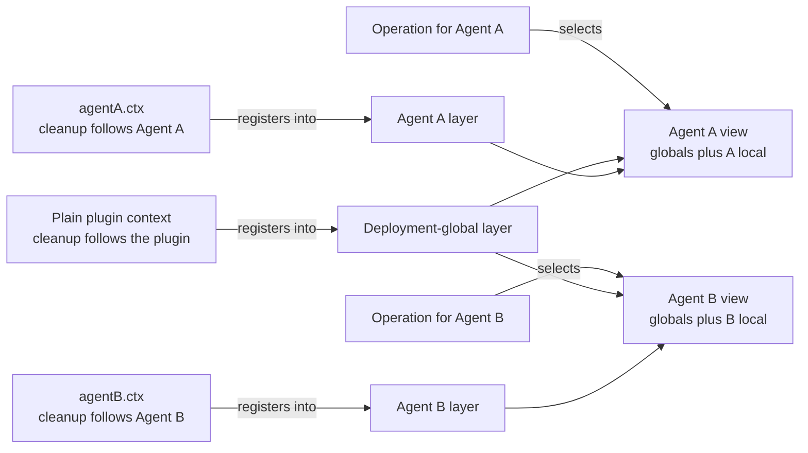
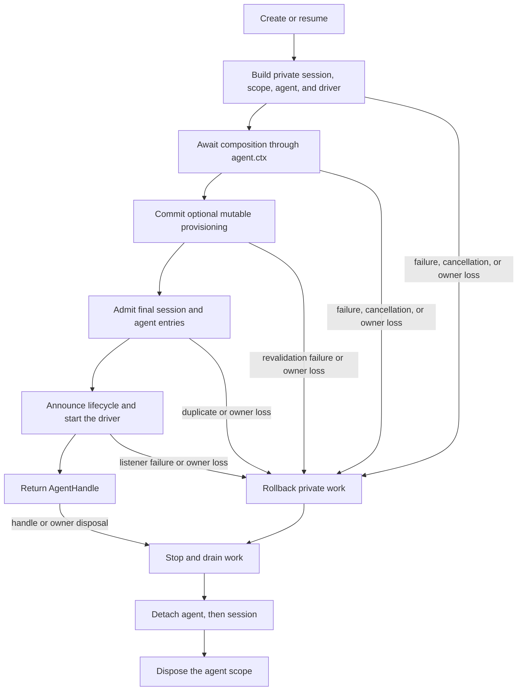

# Agent Note: El agent es un ámbito de registro

Status: implemented

[English](2026-07-08-agent-scope-contexts.md) | [中文](2026-07-08-agent-scope-contexts.zh.md) | Español

## Problema

Una aplicación necesita compartir infraestructura entre muchos agents y a la vez permitir que cada agent tenga sus propias herramientas, contribuciones de prompt, políticas y listeners. Los adaptadores, la persistencia y las interfaces de usuario compartidas pertenecen al despliegue; una persona, una variante de herramienta o un listener suelen pertenecer a un solo agent.

Un grafo de servicios separado por agent duplica la infraestructura compartida. Un grafo de registro global único tiene el fallo opuesto: una contribución específica de un agent puede filtrarse a agents no relacionados. Los contribuyentes necesitan un mecanismo de registro ordinario que determine a la vez quién puede ver una contribución y cuándo se limpia.

El mecanismo también necesita una frontera de publicación. Un agent no debe volverse visible antes de que su mundo local esté completo, y el teardown debe retener ese mundo hasta que el trabajo final se haya detenido.

## Decisión

Cada agent vivo es dueño de una capa de registro plana expuesta como `agent.ctx`. El código registra a través del contexto dueño de una contribución; los servicios sensibles al scope combinan los registros globales del despliegue con exactamente una capa de agent correspondiente; las operaciones eligen esa capa desde su agent real; y la capa existe durante toda la vida publicada del agent.

Cordis es el framework de plugins bajo el SDK. Un **contexto** de Cordis es el objeto que los plugins usan para acceder a servicios y registrar efectos cuya limpieza sigue a ese contexto. El [primer de Cordis](../../../../docs/cordis-primer.es.md) explica el framework con más detalle.

Para la mayoría de los contribuyentes, el contrato completo son cuatro reglas:

| Pregunta | Regla |
|---|---|
| ¿Dónde registro comportamiento para un agent? | Llama a la API de registro ordinaria a través de `agent.ctx` |
| ¿Qué ve una operación para un agent? | Los globales del despliegue más la capa de ese agent, usando las reglas de fusión del servicio propietario |
| ¿Qué listeners con scope se ejecutan? | Los listeners sin scope más los listeners registrados para el agent de la operación |
| ¿Cuánto dura la capa? | El setup se completa antes de la publicación; el dispose la conserva hasta que el trabajo alcanza el reposo |

El scope es plano. La resolución nunca recorre scopes padre o hermano, y la propiedad del ciclo de vida no implica herencia de registro.



Las aristas cruzadas ausentes son la regla de aislamiento: los registros locales del Agent A no entran en la vista del Agent B, y los registros de un padre no entran en un hijo solo porque el padre sea dueño del ciclo de vida del hijo.

El [Agent Note complementario de diseño del runtime](2026-07-12-agent-scope-runtime-design.es.md) explica la implementación y el razonamiento de corrección. El [Agent Note de controles de composición de subagentes](../feature/2026-07-12-subagent-persona-tool-filter-and-depth.es.md) es dueño de la funcionalidad separada `persona`, `toolFilter` y `maxDepth`.

### El origen del registro elige visibilidad y limpieza

Un registro hecho a través de un contexto de plugin ordinario es global al despliegue y se libera con ese plugin. El mismo método llamado a través de `agent.ctx` contribuye a un agent y se libera con el scope de ese agent.

| Origen del registro | Visibilidad por defecto | Se libera con |
|---|---|---|
| Contexto de plugin ordinario | Cada vista de agent elegible | El plugin que registra |
| `agent.ctx` | Exactamente la vista de ese agent | El scope del agent |

Las herramientas, las secciones y variables de prompt, las restricciones de herramientas, los guards y los listeners de eventos con scope adoptan este contrato. Los valores locales con nombre normalmente sombrean un valor global del mismo nombre para ese agent; cada servicio propietario documenta las excepciones y el comportamiento de fusión.

El patrón ordinario de contribución es registrar el mundo local completo durante el setup del agent:

```js
const handle = await ctx.agents.create({
  sessionId: SessionId('reviewer'),
  agentOptions: { model: 'model-name' },
  setup(agentCtx) {
    agentCtx.systemPrompt.section({
      name: 'deployment:persona',
      order: 0,
      text: 'Review code, but do not modify files.',
    })
    agentCtx.tools.register({
      name: 'review_summary',
      description: 'Return the review summary.',
      parameters: { type: 'object', properties: {} },
      async execute() {
        return [{ type: 'text', text: 'review complete' }]
      },
    })
  },
})

ctx.tools.get('review_summary')                // undefined: not global
ctx.tools.get('review_summary', handle.agent)  // the reviewer-local tool

await handle.dispose()
ctx.tools.get('review_summary', handle.agent)  // undefined: scope is gone
```

El setup recibe un contexto de Cordis completo y de confianza para poder componer plugins y servicios ordinarios. Su contrato es solo de composición: conducir o publicar el agent en vuelo a través de casts o llamadas internas al registro no está soportado.

### La operación elige la vista

El origen del registro y el sujeto de la operación son hechos separados. Llamar a un servicio a través de `agent.ctx` selecciona dónde pertenece un registro nuevo; no vincula lecturas posteriores a ese agent.

La búsqueda y ejecución de herramientas reciben el agent para el que actúan. El ensamblaje de prompt recibe un contexto de ensamblaje para el agent cuya petición se está construyendo. El despacho de eventos recibe su sujeto de dominio. Esto mantiene las instancias de servicios compartidos reutilizables entre agents mientras hace explícita la vista de cada operación.

Solo los servicios que adoptan el contrato de scope resuelven una capa de agent. `agent.ctx` no cambia automáticamente llamadas arbitrarias a servicios de Cordis.

### Los eventos con scope mantienen el enrutamiento separado de los datos del evento

Un evento sobre el Agent A normalmente alcanza a los listeners sin scope y a los listeners con scope A, no a los listeners con scope B. Un evento sin sujeto de agent alcanza solo a los listeners sin scope.

A nivel de Cordis, `Scoped<T>` es un receptor de enrutamiento opaco. Lleva el filtro usado para elegir listeners pero no es el objeto de dominio. Las firmas de eventos por tanto mantienen el `Agent`, la ejecución de herramienta, la petición de aprobación u otro sujeto real como argumento explícito que los listeners pueden inspeccionar.

Un listener registrado con `{ global: true }` elude deliberadamente el filtrado de audiencia contextual mientras su limpieza sigue al contexto que registra. Las notificaciones de pertenencia al registro permanecen sin filtrar porque describen el estado compartido del registro, no la operación de un agent. La referencia exhaustiva de eventos es el conjunto de regiones `cordis-surface` generadas en las [páginas de subsistemas](../../../../docs/subsystems/core.es.md) — cada scope de evento en su página propietaria (`agent/*` y `agent-loop/*` en la propia core.md).

### La creación publica al final y el dispose revoca al final

`ctx.agents.create()` y `resume()` construyen una sesión, un scope, un agent y un driver no publicados. Esperan `setup`, invocan sincrónicamente su `AgentSetupCommit` opcional, admiten las entradas finales de sesión y agent, las anuncian en orden, arrancan el loop y solo entonces devuelven un handle. El commit permite que el aprovisionamiento mutable revalide en la frontera exacta de publicación tras cada await de setup; un lanzamiento revierte la transacción privada antes de que se anuncie cualquiera de las identidades, mientras que la revocación tras un commit exitoso es teardown vivo ordinario.

Una señal de creación opcional cancela el trabajo solo mientras create o resume está pendiente. Tras resolver la promesa, el `AgentHandle` devuelto es dueño del dispose explícito.

Si la carga, el setup, el commit de setup opcional, la admisión o la publicación fallan, la transacción privada revierte todo lo que preparó. Las operaciones concurrentes que usen el mismo ID vivo suministrado por el llamador pueden llegar ambas al setup, pero la entrada final del registro admite solo una; cada perdedor rechaza y limpia sus recursos privados. La reutilización secuencial tras un dispose esperado sigue siendo válida.

`AgentHandle.dispose()` invierte la frontera. Desactiva la creación o la conducción, espera a que la publicación síncrona se desenrolle, detiene y drena el driver y los flushes finales de sesión, desconecta el agent y la sesión y, finalmente, libera el scope. Las peticiones de dispose repetidas o en carrera se unen a una única promesa de completado.

El contexto de Cordis llamante y la fábrica concreta de `AgentLoop` son co-propietarios estructurales. Descargar cualquiera de ellos libera la transacción o el agent vivo.



## Seguridad y autoridad no son objetivos

Los scopes de agent componen registros de confianza del mismo proceso. No aíslan plugins en sandbox, no definen un entramado de autoridad padre-a-hijo, no congelan concesiones en la creación ni garantizan que un hijo no pueda hacer más que su padre.

Un padre puede ser dueño de un hijo cuyas herramientas visibles sean más amplias que las suyas porque la propiedad del ciclo de vida no dona ni limita registros. Un plugin que sostiene un contexto de Cordis también se ejecuta en el mismo proceso y puede llamar directamente a los servicios disponibles.

Los despliegues que necesiten no escalada requieren una representación de autoridad, una regla de propagación y una comprobación de ejecución separadas. Las concesiones subconjunto del padre, las instantáneas de autorización en el momento de la creación, las API explícitas de concesión futura y las etiquetas genéricas de capacidad/salida/terminación quedan fuera de esta decisión.

## Alternativas consideradas

Los diseños rechazados o bien separan la visibilidad de la limpieza, o bien cubren solo una familia de registro, o bien duplican la infraestructura compartida, o bien confunden la propiedad del ciclo de vida con la herencia.

### Pasar una opción de agent a cada registro

Una API como `tools.register(definition, { agent })` repite el cableado del scope en cada registro y permite que la propiedad de visibilidad se separe de la propiedad de limpieza. Registrar a través de `agent.ctx` hace que ambos hechos sigan a un único dueño de efecto de Cordis.

### Filtrar eventos manteniendo los registros globales

El filtrado de listeners evita que el hook equivocado se ejecute, pero no da scope a los schemas de herramientas, la búsqueda ejecutable, las secciones de prompt, las variables ni otros datos registrados. La composición local al agent seguiría requiriendo mutación global temporal.

### Crear un grafo de servicios por agent

La vista requerida son servicios de despliegue compartidos más una capa de registro local. Los grafos por agent duplican adaptadores y complican la persistencia compartida, los registros de providers y el arranque de la aplicación.

### Heredar scopes de registro del padre

La paternidad describe el ciclo de vida y el linaje de conversación, no una política de fusión universal. La búsqueda jerárquica hace que servicios no relacionados hereden accidentalmente y no puede definir seguridad sin un modelo de autoridad separado.

## Consecuencias

Los contribuyentes usan un patrón familiar: registra el comportamiento compartido a través de un contexto de plugin, registra el comportamiento local a través de `agent.ctx`, selecciona el agent real en las operaciones y libera el handle devuelto. El setup y su commit de publicación opcional son atómicos desde la perspectiva de un observador, y el teardown preserva el comportamiento local hasta que el trabajo se detiene.

El coste es la selección explícita de sujeto, la creación programática asíncrona y la adopción de scope específica de cada servicio. El scope de registro plano es deliberadamente no autoridad, y los controles de composición de subagentes siguen siendo una funcionalidad separada en lugar de semántica de scope oculta.
