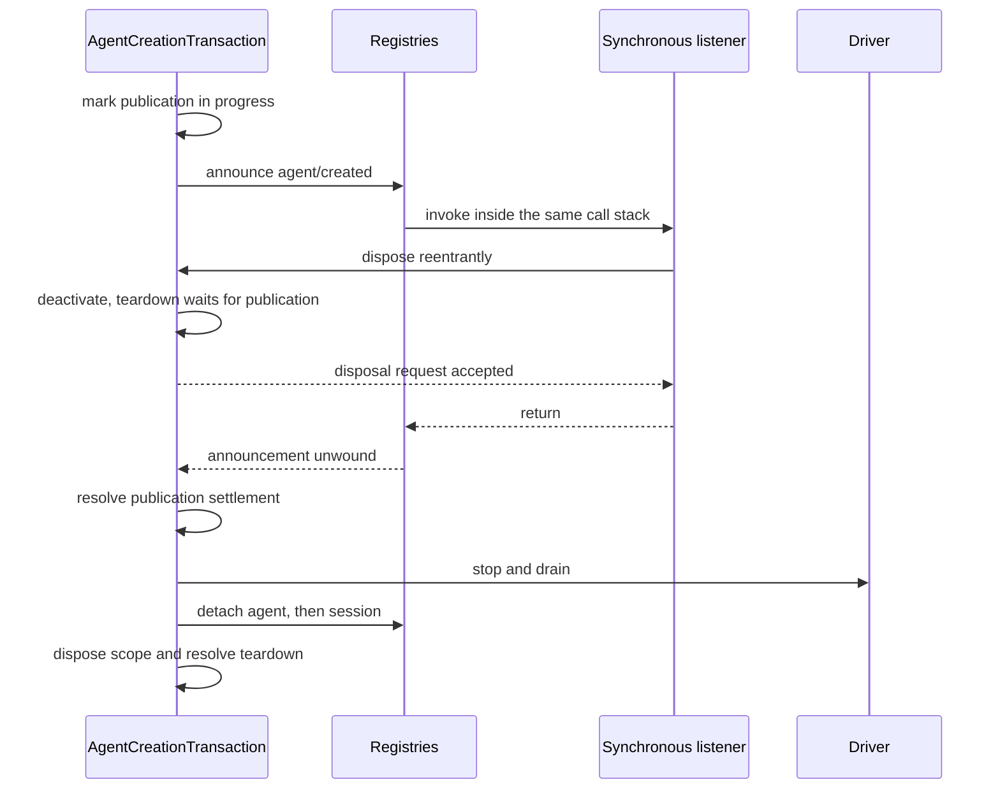

# Agent Note: Diseño y corrección del runtime del ámbito por agent

Status: implemented

[English](2026-07-12-agent-scope-runtime-design.md) | [中文](2026-07-12-agent-scope-runtime-design.zh.md) | Español

## Problema

El [contrato de scope de agent](2026-07-08-agent-scope-contexts.es.md) es simple para los colaboradores: registra a través de `agent.ctx`, resuelve una vista global-más-agent, publica solo tras el setup y retiene el scope hasta que el trabajo se detiene. El runtime debe preservar ese contrato a través de un framework de plugins cooperativo, la creación asíncrona, los listeners reentrantes, los commits de sesión durables y el fallo de worker o proceso.

El principal riesgo de diseño es añadir un segundo mecanismo para cada carrera. Reservas separadas, centinelas de preparación, relés de cancelación, capas de instantáneas y registros de protección pueden reflejar el mismo hecho hasta que ningún lector pueda decir cuál es autoritativo. Esa maquinaria también anima al runtime a tratar llamadas tipadas de confianza como límites de serialización hostiles.

La implementación necesita suficiente estado para preservar los límites reales de propiedad y settlement, pero no más. Un revisor de corrección debe poder seguir un hecho desde la aceptación hasta la publicación y el teardown sin conciliar representaciones paralelas.

## Decisión

El runtime usa un mecanismo por hecho independiente. El enrutamiento de scope tiene un carrier opaco y un almacén de capas compartido; cada objeto de registro vivo tiene un registro de entrada; cada operación de crear o resumir tiene una transacción; las llamadas tipadas dentro del mismo proceso toman prestados valores readonly; los límites reales de datos se materializan una vez; el resultado cooperativo del ensamblado de prompt es autoritativo; y el código de worker/proceso conserva estado terminal y de quiescencia separado solo donde propietarios distintos pueden competir de verdad.

El diseño puede leerse como siete elecciones:

| Problema | Mecanismo autoritativo |
|---|---|
| Seleccionar las registraciones globales más las de un agent | Clave de scope opaca, carrier de enrutamiento y almacén de capas compartido |
| Ser dueño de un agent o sesión vivos | Un registro de entrada capturado por su disposer |
| Coordinar crear/resumir | Una `AgentCreationTransaction` |
| Proteger datos durables, encolados, de modelo o de wire | Materializar una vez en ese límite |
| Pasar valores tipados dentro de un proceso | Contrato de préstamo readonly |
| Componer el prompt y el conjunto de herramientas visibles para el modelo | Una vista de herramientas compartida más el resultado autoritativo del waterfall de ensamblado |
| Coordinar el apagado de subagente, worker y proceso | Una señal de cancelación más los hechos terminales/de quiescencia independientes de ese límite |

El resto de esta Agent Note desarrolla esas elecciones en orden de dependencia: mecánica de Cordis, enrutamiento de scope, creación y commit de sesión, herramientas y prompts, subagentes y flujos de trabajo, y después comprobaciones ejecutables.

La [Agent Note del 8 de julio](2026-07-08-agent-scope-contexts.es.md) sigue siendo el contrato del colaborador. La [Agent Note separada de controles de composición de subagente](../feature/2026-07-12-subagent-persona-tool-filter-and-depth.es.md) es dueña de `persona`, `toolFilter` y `maxDepth`; este documento solo discute cómo encaja su setup en el ciclo de vida.

## Modelo de Cordis: contexto, fiber, effect, receiver y waterfall

Para entender la implementación se necesitan cinco ideas de Cordis. Un contexto selecciona servicios y propiedad de registros; un fiber es un plugin vivo o un ciclo de vida hijo; un effect adjunta limpieza a un fiber; un receiver de eventos selecciona listeners; y un waterfall deja que los listeners transformen o cortocircuiten una operación en secuencia.

### Un contexto es una ruta de propiedad a través de un grafo de servicios

Todos los agents comparten un grafo de servicios de Cordis. Un contexto derivado no clona `ToolRuntime`, `SystemPrompt`, la persistencia ni los adaptadores de modelo; cambia cómo se etiquetan los registros hechos a través de ese contexto y qué effects son dueños de su limpieza.

`agent.ctx` es ese contexto derivado. Las llamadas de servicio siguen llegando a las instancias compartidas, mientras que un registro puede inspeccionar su contexto llamante y almacenar una contribución bajo la clave de scope más cercana. Los contextos de plugin ordinarios no llevan clave de scope y por tanto registran globalmente.

### Los fibers y los effects hacen estructural la limpieza

Un fiber de Cordis es la instancia viva que se crea cuando se activa un plugin o un contexto hijo. Su estado registra si ese ciclo de vida está activo, descargándose, fallido o dispuesto. `ctx.effect()` y `ctx.on()` devuelven disposers y también adjuntan esos disposers al fiber registrador, de modo que descargar un plugin o un scope de agent elimina todo lo registrado a través de ese contexto sin un inventario separado.

La implementación de fiber de Cordis vendida establece la propiedad antes de que se ejecuten el setup arbitrario o los observers de `internal/plugin`. Una descarga reentrante puede ver el fiber o effect hijo que ha empezado, rechazar effects añadidos después de que la descarga comience y unirse a la limpieza ya iniciada a través de un disposer público de un solo disparo. Los observers de teardown se contienen individualmente para que una callback no pueda impedir la limpieza estructural.

Estas son garantías de ciclo de vida del framework, no política específica de agent. La creación de agent depende de ellas porque el setup puede activar plugins arbitrarios y reentrar síncronamente en la disposición del propietario.

### Los receivers enrutan listeners; los waterfalls componen decisiones

Cordis filtra los listeners usando el receiver de despacho (`this`), mientras que los listeners del harness necesitan un sujeto explícito de agent, ejecución, petición u otro. `Scoped<T>` marca el receiver esperado por una declaración de evento con ámbito, pero el carrier de runtime no expone deliberadamente ninguna API de sujeto.

Las helpers de producto construyen por tanto el carrier y pasan el sujeto de dominio por separado. Esto impide que el enrutamiento de listeners se convierta en un modelo de objetos alternativo y mantiene las firmas de eventos comprensibles sin conocimiento de los internos del carrier.

Un waterfall de Cordis es un despacho de estilo middleware. Cada listener recibe `next()`: llamarlo delega en los listeners restantes y en la operación base, mientras que devolver sin llamarlo cortocircuita o reemplaza el resultado aguas abajo. Los waterfalls impulsan el ensamblado de prompt y la política de herramientas; los eventos de emisión ordinarios notifican síncronamente, y los eventos paralelos esperan a todos los listeners sin un resultado de veto.

## Enrutamiento de scope: una clave opaca selecciona una capa

El paquete de scope implementa el objeto más pequeño necesario para el enrutamiento de Cordis. Su carrier contiene solo un filtro de servicios compuesto y un predicado de scope, mientras que el paquete registra la clave opaca en privado y expone por separado el disposer de quiescencia del fiber de scope.

### La identidad de scope usa identidad de objeto

Un `ScopeKey` es un objeto opaco comparado por identidad. El harness usa el `Agent` vivo como su propia clave, pero la primitiva es neutral al dominio y soporta otros propietarios con ámbito.

`createScope(parent, key)` devuelve un scope cuyo `ctx` comparte los servicios del padre y cuyos effects están etiquetados con esa clave. `scopeOf(ctx)` lee la clave de registro más cercana. `scopeTarget(base, key)` crea el receiver de eventos cuyo filtro conserva el filtro de servicios de Cordis del receiver base y luego admite listeners sin ámbito y listeners con esa clave exacta.

El receiver es un carrier pequeño en lugar de un proxy transparente del objeto de dominio. El código que necesita el agent recibe el argumento de evento explícito; el código que necesita la propiedad de registro recibe `agent.ctx`.

### Las lecturas de registro superponen una capa exacta

Los registros con ámbito usan `ScopedLayers` para ser dueños de un agregado global ansioso y de agregados con clave de identidad creados perezosamente. Una lectura resuelve la capa global y a lo sumo una capa local exacta; nunca crea estado ni atraviesa parentesco. La visibilidad del registro y la propiedad del effect de Cordis derivan del mismo contexto, y la reclamación espera a que el agregado completo de la capa concreta esté vacío ([decisión](2026-07-12-scoped-layers-store.es.md)).

Cada servicio conserva su regla de dominio. Las vistas con nombre de comando y prompt usan la fusión de sombreado compartida ordenada por inserción; las herramientas conservan un resolver más rico porque las restricciones filtran los globales antes de añadir las herramientas locales y el transporte reservado de Code Mode se inserta por separado. Las variables de prompt y los guards de herramienta conservan la iteración viva, mientras que la pertenencia al provider de herramientas se materializa por ensamblado. Scope suministra el ciclo de vida de almacenamiento y el sombreado con nombre, no una vista de registro universal.

### Las helpers de despacho fusionadas evitan la deriva de sujeto

`agentEvents(context, agent)` construye el carrier del agent e inyecta ese mismo agent como sujeto de evento. Los servicios de sesión, herramienta, aprobación, prompt y subagente derivan igualmente el enrutamiento del objeto que ya poseen en lugar de aceptar una clave no relacionada.

El marcador de tipo rechaza los errores ordinarios de receiver desnudo, y los invariantes de desarrollo cubren el despacho directo en JavaScript o casteado. El sujeto sigue siendo explícito porque la corrección del enrutamiento y los datos útiles del evento son preocupaciones distintas.
## Creación de agent: una transacción es dueña de la operación completa

Crear y resumir son un único ciclo de vida asíncrono con varias fases, no varios ciclos de vida. `AgentCreationTransaction` es dueña de la vivacidad de llamador y factory, la cancelación opcional, los recursos privados, la publicación, la reversión y el teardown memoizado que observa cada propietario.

### Los registros de entrada del registro son los únicos registros de identidad vivos

AgentRegistry y SessionStore mantienen cada uno una entrada por objeto vivo. La entrada contiene el id estable, el objeto, el carrier con ámbito y la pequeña cantidad de estado de publicación o adjunto que pertenece a ese objeto.

Una clausura de desacople captura su entrada exacta. Elimina solo cuando el mapa sigue apuntando a esa entrada, de modo que un disposer antiguo no pueda eliminar un objeto posterior que reutiliza el mismo id. Ningún registro relee un objeto mutable del llamador para decidir la identidad.

No existe API de reservas. Los ids suministrados por el llamador se admiten en la entrada final. Operaciones concurrentes del mismo id pueden completar ambas el setup privado; exactamente una llamada final a `enter()` tiene éxito, y todo perdedor revierte sus recursos privados. La reutilización secuencial es válida después de que el disposer anterior alcanza la quiescencia.

### La transacción es dueña de la preparación antes de esperarla

La transacción se instala bajo el contexto de Cordis llamante y bajo la factory concreta de AgentLoop antes de que la carga de persistencia o el setup puedan suspenderse. También observa una señal opcional de crear/resumir hasta que la operación pública se liquida.

Crear prepara una Session nueva. Resumir carga y valida la Session persistida antes de preparar la misma identidad de sesión viva. Ambos caminos construyen después el scope, el agent y el driver e invocan el mismo algoritmo de setup/publicación.

La factory almacena objetivos de traza concretos pero los invoca a través de una traza de Cordis ligada al llamador. Esto preserva el origen de dependencia y la propiedad del llamador sin apilar proxies de traza.

### El setup es composición de confianza dentro de un mundo privado

El setup recibe el contexto hijo completo y puede esperar la activación de plugins. Puede registrar herramientas, secciones de prompt, restricciones, listeners y otros effects, pero el contrato público no soporta impulsar ni publicar el agent en vuelo a través de casts o llamadas internas al registro.

La transacción corre la carga asíncrona y el setup contra la desactivación en lugar de esperar para siempre una promise propiedad de código externo. Si gana la cancelación o la descarga del propietario, la creación pública rechaza tras la limpieza propiedad de la transacción incluso cuando la promise externa nunca se liquida.

### La publicación tiene un único camino de commit ordenado

La publicación admite y anuncia los recursos en el orden que exigen los observers:

1. Entrar en la sesión.
2. Entrar en el agent.
3. Anunciar `session/created`.
4. Anunciar `agent/created`.
5. Habilitar el impulso público.
6. Emitir `agent/session-start`.
7. Arrancar el driver.

El agent nunca impulsa antes de que ambos registros y las notificaciones de creación coincidan. Un listener síncrono puede vetar o disponer a un propietario; la transacción registra la publicación en curso y espera a que esa pila de callbacks se desenrolle antes de que el teardown continúe. Cada anuncio de creación que comienza tiene un anuncio de disposición correspondiente durante la reversión.

El diagrama de secuencia aísla la carrera no obvia: un listener de creación síncrono puede solicitar la disposición mientras la pila de llamadas de publicación aún posee ambas entradas de registro. El teardown debe desactivar de inmediato pero esperar a que esa pila se desenrolle antes de detener y desacoplar nada.

### El teardown preserva el trabajo antes de revocar registraciones

Toda petición de teardown se une a un camino memoizado. El orden es:

1. Desactivar la creación o el impulso y dejar que la publicación síncrona termine.
2. Detener y drenar el driver, descartando cualquier inyección que siga pendiente.
3. Desacoplar el agent.
4. Desacoplar la sesión.
5. Disponer el scope del agent.
6. Retirar el seguimiento de propiedad de la transacción.

Este orden permite que los eventos finales de agent y sesión usen los listeners con ámbito correspondientes y mantiene los observers de persistencia adjuntos hasta el flush final. La disposición del scope llega al final porque la revocación de registros es el límite de ciclo de vida visible externamente.

## Adjunto de sesión: materializar, validar, commit, notificar

Los eventos de sesión cruzan un límite durable, así que el adjunto es dueño de sus datos. El resto del algoritmo usa una entrada adjunta y un punto de commit.

### Los datos durables se materializan una vez

Las cabeceras de sesión, los seeds y los eventos adjuntos son datos JSON sin pérdida. El constructor de Session o el camino de adjunto los materializa y valida antes del almacenamiento y expone instantáneas congeladas, de modo que una mutación posterior del llamador no pueda cambiar la persistencia, el replay ni la reconstrucción del modelo.

Este es un límite de propiedad real: los valores salen del llamador, pueden persistirse y deben reconstruir la misma petición después. Es intencionadamente más estricto que una callback tipada dentro del mismo proceso o una definición de registro.

### Los listeners previos al commit pueden vetar; los observers posteriores al commit no

El adjunto sigue una secuencia:

1. Materializar el evento durable y exponer la intención.
2. Reclamar la SessionEntry y rechazar el adjunto reentrante en esa entrada.
3. Resolver las callbacks con ámbito y ejecutar la validación interna de invariantes.
4. Empujar exactamente una vez; este es el punto de commit.
5. Notificar a cada observer de forma independiente, conteniendo los fallos síncronos y asíncronos.
6. Liberar el estado de adjunto y honrar un desacople solicitado durante la publicación.

Ningún error de observer hace parecer no cometido un evento cometido, y un listener malo no puede privar de su turno a listeners posteriores. Los invariantes de sesión escenifican su transición antes del commit y la aplican solo cuando el mismo evento llega al observer posterior al commit contenido.

`flush()` arranca cada listener de persistencia y espera cada resultado antes de informar del fallo. Este comportamiento deliberado de todo-liquidado evita que un fallo síncrono prive de su turno a otro backend o al flush final.

## Límites de confianza: copiar solo cuando la propiedad cambia de verdad

El runtime distingue los contratos tipados dentro del proceso de los límites de serialización y durabilidad. Esta es la regla principal de simplificación para valores y callbacks.

| Límite | Regla de propiedad |
|---|---|
| Llamada tipada de servicio/plugin en el mismo proceso | Tomar prestados valores y callbacks readonly |
| Configuración de plugin parseada o archivo externo | Validar la entrada semántica y estructural |
| Mensaje de inbox encolado | Materializar antes del consumo asíncrono |
| Entrada o salida JSON de modelo/herramienta | Materializar en el límite de modelo/herramienta |
| Datos durables de sesión o persistencia | Materializar y validar antes del commit |
| Mensaje de worker, proceso o wire | Serializar, validar y ser dueño del valor decodificado |

Las pruebas que fabrican getters hostiles, reemplazan callbacks tipadas tras la entrega o castean objetos de servicio falsos no definen por sí mismas un contrato de producción. El runtime mantiene comprobaciones donde los datos cruzan un límite de parser, cola, modelo, durable, archivo, worker, proceso o wire, y confía en los tipos readonly más la disciplina de plugins dentro del proceso de confianza.

El confinamiento de callbacks es independiente de la propiedad de datos. Los listeners son código de extensión arbitrario y pueden lanzar incluso cuando sus argumentos son de confianza; los caminos de publicación y post-commit contienen igualmente los fallos según su contrato de evento.
## Herramientas y prompts: una vista, ensamblado autoritativo, resultados cometidos

La presentación y la ejecución de herramientas comparten un resolver privado. El ensamblado de prompt sigue siendo composición cooperativa de confianza: los registros suministran la entrada ordenada, y el valor devuelto por el waterfall de ensamblado es exactamente lo que el loop registra y envía. La ejecución usa límites unidireccionales separados solo donde la política o el settlement de resultados deben ser monótonos.

### Un resolver define la vista de herramientas

El resolver privado aplica el modo de presentación actual, las restricciones globales vivas, el solapamiento local exacto y el sombreado local. Los schemas, la búsqueda, la ejecución, la generación de SDK de Code Mode y la validación de restricciones usan ese resolver o su vista de nombres globales previa a la restricción.

La [Agent Note de controles de composición de subagente](../feature/2026-07-12-subagent-persona-tool-filter-and-depth.es.md#tool-filtering-is-one-live-global-view-rule) es dueña de la semántica visible para el usuario de allow/deny. El requisito de implementación es el acuerdo: un global filtrado no puede seguir siendo ejecutable a través de otra ruta de búsqueda, y una definición sombreada localmente es la misma definición presentada y ejecutada.

`ToolRestriction` acepta nombres de allow/deny readonly y los compila en conjuntos internos. Las restricciones múltiples se intersectan. Los métodos públicos `visible()` y `knownNames()` son innecesarios porque solo el registro necesita las vistas intermedias.

### La ejecución de herramientas es dueña de la identidad y de la materialización de límites

El registro asigna a cada ejecución un token `Symbol` con marca nuevo. Las llamadas anidadas de Code Mode transportan el token externo como `parent`, de modo que la salida estructurada pueda correlacionar una captura interna con su resultado `run_code` envolvente por identidad.

Un Symbol nuevo asignado por el registro proporciona identidad de ejecución sin colisiones sin un registro de pertenencia WeakSet. Los llamadores no pueden suministrar el token propio de la ejecución a través de `ToolExecutionInput`; solo reciben el `ToolExecution` propiedad del pipeline después de que el registro lo crea. Este es un contrato tipado de confianza, no una defensa de runtime contra casts arbitrarios o llamadores de JavaScript.

Los argumentos se materializan una vez donde el JSON de modelo/herramienta entra en el pipeline. Los listeners previos, envolventes y posteriores a la ejecución operan sobre la ejecución tipada y las decisiones. La correlación de ids de llamada, la aprobación, los guards monótonos y el anidamiento de Code Mode siguen siendo comprobaciones relacionales explícitas.

Tras la normalización posterior a la ejecución o del pipeline externo, el registro toma una instantánea sin pérdida del resultado candidato, convierte un fallo de instantánea en un error ordinario, invoca la callback `ToolDefinition.finalizeContent` opcional instantánea de la llamada y materializa y congela después una única vez el resultado final aceptado. La callback solo puede reemplazar contenido, de modo que la identidad de error estructurado, los contextos y los metadatos siguen siendo propiedad del registro incluso cuando una herramienta impone un límite de resultado de última milla. Cada observer síncrono de `tools/result` recibe ese objeto cometido exacto, y los fallos de observers se contienen individualmente. Un fallo del pipeline externo o de la instantánea candidata se normaliza antes del contenido final, de modo que los observers puedan descartar el trabajo escenificado contra el mismo límite autoritativo.

### El waterfall de ensamblado es dueño de la composición final visible para el modelo

SystemPrompt primero resuelve las secciones, variables y providers de herramientas global-más-agent en una contribución de registro determinista. El waterfall `system-prompt/assemble` filtrado por scope puede después reordenar, reemplazar, añadir o eliminar cualquier sección, variable o schema. Su ensamblado devuelto es autoritativo; no hay pasada de restauración posterior ni metadatos de finalidad en secciones de prompt ordinarias, definiciones de herramientas o resultados de providers.

Este es un punto de extensión de confianza dentro del mismo proceso, no un límite de autoridad. Un listener que cambia el schema de `run_code` de Code Mode o las instrucciones de `tools:sdk`, o el schema de captura o la instrucción de un hijo estructurado, es dueño de preservar un protocolo coherente en el ensamblado que devuelve. ToolRuntime sigue reservando `run_code` frente al registro y la restricción de herramientas ordinarios porque esos son invariantes del registro, pero el middleware de ensamblado sigue siendo libre de transformar la superficie final visible para el modelo.

Scope resuelve directamente el problema real de aislamiento. Las contribuciones de salida estructurada se registran en el scope exacto del hijo, mientras que Code Mode deriva su transporte y SDK de la misma vista de herramientas resuelta. Un segundo sistema de protección con nombre necesitaría otra regla de propiedad y colisión a través de providers de schema arbitrarios — incluidos providers que contribuyen intencionadamente nombres duplicados — sin crear un nuevo límite de confianza.

### La salida estructurada comete solo resultados autoritativos

La salida estructurada combina la composición con ámbito de hijo con un commit de ejecución en dos fases. El hijo registra su herramienta `structured_output` y su instrucción antes de la publicación; un listener de ensamblado de confianza puede transformar esas contribuciones ordinarias y es responsable de preservar el protocolo si se espera que el hijo se complete. El cuerpo de la herramienta valida un candidato y lo escenifica por el `ToolExecution` actual, pero la captura exitosa solo la deciden las observaciones inmutables de `tools/result`.

Para una llamada nativa, el observer elimina la escena y comete su valor solo cuando el resultado final de esa ejecución exacta tiene éxito. Un bloque posterior a la ejecución o un fallo del pipeline externo no puede por tanto dejar un valor capturado.

Para una llamada de SDK de Code Mode, el resultado interno exitoso registra `{ parentToken, value }` en lugar de cometer. El observer espera la ejecución de `run_code` cuyo token coincide con `parentToken` y comete solo si ese resultado final externo también tiene éxito. El fallo del programa, el aborto de runtime o la denegación de política externa posterior descartan el valor pendiente.

Una vez que un valor está pendiente o cometido, un guard monótono con ámbito deniega llamadas de herramienta posteriores. La ejecución estructurada exitosa llama a `exec.concludeTurn()`, de modo que su propio resultado inmutable transporta `concludesTurn: true` y el loop termina el loop de herramientas en ese paso. Un fallo de validación de schema sigue siendo un error de herramienta `INVALID_ARGS` ordinario y deja al hijo capaz de reintentar dentro del mismo turno.

La contribución de registro de Code Mode puro omite `structured_output` de los schemas de wire nativos y lo expone a través del SDK generado. El waterfall de ensamblado puede cambiar deliberadamente esa presentación; la ejecución sigue validando contra la definición con ámbito de hijo, y el listener es dueño de la coherencia de cualquier ruta alternativa visible para el modelo que cree.

### Tres límites de ejecución son deliberadamente unidireccionales

El ensamblado de prompt es intencionadamente cooperativo, pero tres hechos de ejecución necesitan settlement unidireccional después de sus etapas extensibles:

| Límite | Poder final | Por qué el orden ordinario de listeners es insuficiente |
|---|---|---|
| Pre-política de herramienta | Denegar monótonamente | Un listener posterior no debe poder volver a permitir una llamada ya denegada |
| Resultado de herramienta | Observar el resultado inmutable cometido | La salida estructurada debe cometer solo el resultado que realmente escapó del pipeline |
| Continuación de turno | Concluir a través del resultado de herramienta cometido | Una salida terminal cometida debe terminar el turno |

`ToolGuard` es el registro de política monótono. La observación de herramienta cometida es el punto contenido `tools/result` descrito arriba. La salida estructurada terminal marca su propia ejecución con `concludesTurn`, de modo que la terminalidad es un dato del resultado autoritativo en lugar de una decisión de hook separada.

### Los servicios de skill y aprobación confían en llamadores tipados

Las definiciones del registro de skill y las políticas de aprobación son contratos readonly dentro del mismo proceso. Sus servicios no clonan objetos de callback ni se defienden contra el reemplazo de callbacks tras la entrega.

Skill sigue validando los archivos de skill externos y la salida de provider parseada, enruta los catálogos a través de la vista de herramientas del agent llamante y dispone las registraciones exactamente. La aprobación sigue resolviendo la política, observando la cancelación, enrutando `approval/request` por `request.agent`, registrando el par de auditoría durable y conteniendo los fallos del respondedor y de los observers posteriores al commit.

## Subagentes: la publicación es la promise de arranque

El arranque de un subagente tiene una transferencia de propiedad. El provider es dueño de los recursos no publicados hasta que su promise de arranque se cumple con una run publicada; el llamador es dueño de la run devuelta y debe disponerla.

### El contrato de servicio tiene un canal de cancelación

`SubagentProvider.start()` y `SubagentRuntime.start()` devuelven `Promise<SubagentRun>`. La promise se cumple después de que el backend cruza su límite de publicación, de modo que los llamadores y los observers de `subagent/start` nunca necesitan una segunda promise `run.started`. El trabajo de provider que falla antes de la publicación rechaza `start()`; los resultados de prompt, turno, cancelación e infraestructura posteriores a la publicación se liquidan a través de `SubagentRun.result` sin ocultar el id del hijo, según exige la [decisión de catálogo durable](../feature/2026-07-22-durable-subagent-catalog-and-list-agents.es.md).

`SubagentStartRequest.signal` es obligatorio. Abortarla solicita la cancelación durante el arranque y a lo largo del trabajo restante de preparación o turno de la run publicada. `SubagentRun.dispose()` también solicita la cancelación y espera la quiescencia. No hay canal público separado `run.cancel()`.

Las conversaciones continuables usan sus operaciones separadas de creación y seguimiento y no tienen `SubagentRun`; su manager es dueño de cada `AgentHandle` residente.

El servicio valida las capacidades del provider y la semántica de petición antes de llamar al provider. Un rechazo del provider limpia los recursos no publicados antes de que el rechazo escape y no emite ningún par `subagent/start`/`subagent/end`. Tras el cumplimiento, el servicio adjunta la observación de resultados, emite el start con ámbito y devuelve la run; un rechazo de resultado posterior a la publicación cierra ese par. La eliminación del provider impide arranques posteriores pero no revoca una run que el provider ya aceptó.

### Los providers dentro del proceso reutilizan la transacción central

Spawn y fork comparten un driver dentro del proceso. Crea el hijo a través de `parent.ctx`, pasa la signal obligatoria a la transacción central de creación e instala las contribuciones de persona, restricción de herramientas y salida estructurada durante el setup no publicado.

El provider espera la creación y devuelve solo la run publicada. En la entrega, la creación central desacopla su listener de aborto solo de creación; el provider vuelve a comprobar de inmediato la signal antes de instalar el listener de run viva, de modo que un aborto en ese intervalo estrecho dispone el handle nuevo en lugar de escapar a la cancelación. El teardown del padre sigue al hijo porque la operación pertenece a `parent.ctx`; la descarga del provider bloquea arranques nuevos pero no se convierte en un segundo propietario de revocación para runs aceptadas. El disposer de la run cancela al hijo y espera el teardown ordenado del AgentHandle.

Spawn usa un seed de sesión vacío. Fork usa un prefijo de turno completado validado. El seeding de conversación cambia solo el historial y no importa scope, herramientas, servicios ni autoridad.

### Los providers ACP son dueños del proceso hasta la preparación o la limpieza

Un provider ACP cruza un proceso y un límite de wire reales, así que conserva la validación, el saneamiento del entorno, la serialización de mensajes, las carreras de aborto/proceso y la quiescencia de matar-para-salir.

El arranque se resuelve solo después de que `initialize` y `newSession` tienen éxito. Un aborto, un fallo de spawn, un fallo de RPC o una respuesta de arranque no válida siegan el proceso antes del rechazo. Tras la preparación, el resultado mapea el resultado de prompt de ACP y la salida en streaming; la disposición solicita la cancelación, cierra la conexión y espera la salida del proceso a través de un camino memoizado.

## Flujos de trabajo y procesos ACP: conservar solo los hechos asíncronos independientes

Los puentes de worker y de proceso hijo necesitan más estado que los registros dentro del mismo proceso porque los mensajes, la muerte del proceso y la limpieza pueden liquidarse de forma independiente. Su estado se organiza en torno a esos hechos reales en lugar de protocolos de cancelación duplicados.

### Los hijos de workflow son arranques pendientes o registros publicados

El host de workflow mantiene promises de arranque de provider pendientes y registros de hijos publicados. Un hijo pasa de pendiente a publicado solo cuando `SubagentRuntime.start()` asíncrono se cumple; los arranques rechazados limpian su trabajo parcial de provider y no producen ningún par de ciclo de vida de hijo.

Un AbortController propiedad del host suministra la signal obligatoria a los hijos pendientes y vivos. Cerrar la admisión de workflow aborta esa signal, de modo que no hay un RPC de worker `ChildCancel` duplicado ni un fan-out explícito `run.cancel()` del lado del host. La quiescencia espera tanto los arranques pendientes como la disposición de los hijos publicados.

El límite de worker sigue serializando peticiones y resultados. El host conserva el arbitraje de primer resultado terminal, la contabilidad exacta de hijos, el manejo de muerte de worker, la terminación con gracia, el rechazo de mensajes tardíos/duplicados y la limpieza acotada, porque la recepción de resultados, la salida del worker y la quiescencia del hijo son hechos genuinamente independientes.

### El resultado terminal y la limpieza física permanecen separados

El resultado de workflow registra el primer resultado terminal aceptado según las reglas públicas de precedencia. La limpieza puede continuar después de elegir ese resultado: los hijos vivos todavía necesitan disposición, un worker todavía necesita terminación, y un backend externo lento puede sobrevivir al límite de gracia configurado.

La disposición pública reclama su promise memoizada antes de invocar callbacks. La muerte del worker cierra la admisión antes de procesar cualquier petición de hijo tardía encolada, sintetiza los fines de ciclo de vida ausentes y arranca la limpieza de hijo/proceso sin reescribir un resultado ya reclamado.

### El settlement de prompt de ACP no depende de la entrega de actualizaciones

El [puente ACP solo de automatización](../simplification/2026-07-23-acp-automation-only-protocol.es.md) correlaciona directamente un prompt en vuelo con su turno de mensaje de usuario observado. No escanea desde una marca de agua de registro ni usa el estado de sesión como segundo oráculo de reconciliación.

El listener de eventos de sesión liquida la correlación desde el `turn/end` coincidente incluso cuando una actualización de mensaje cometido no puede llegar al cliente. La entrega de actualizaciones no puede por tanto dejar la sesión permanentemente en vuelo. ACP crea ids de sesión nuevos asignados por el servidor y es dueño de cada handle de agent resultante hasta el teardown de la conexión.

## Aplicación de la corrección

El diseño se aplica en los tipos, en los puntos de escape de runtime, en los contratos generados y en las pruebas de comportamiento. A ninguna capa se le pide que pruebe lo que no puede observar.

### Los tipos hacen difícil el mal uso del camino ordinario

Los contratos readonly describen valores prestados dentro del mismo proceso. `Scoped<T>` marca los receivers de eventos, `agentEvents()` fusiona carrier y sujeto, las entradas de herramienta omiten los tokens propiedad del registro y los tipos de retorno asíncronos de subagente exponen directamente la publicación y el settlement.

TypeScript no puede gobernar casts de JavaScript, el despacho directo de Cordis, los mensajes de proceso ni los archivos durables, así que la aplicación de runtime permanece en esos puntos de escape.

### Los invariantes de runtime cubren los hechos entre servicios

El acompañante `dsh-scope/invariant` verifica, cuando se selecciona, que cada evento con ámbito declarado usa un carrier marcado y que las familias de eventos que exponen un sujeto usan la clave coincidente. La contribución separada `dsh-session/invariant` escenifica la validación de traza antes del commit de adjunto y avanza después de que el mismo evento comete; ambas se registran a través de `ctx.invariants`.

El plugin no vigila el setup de confianza escaneando registros ni rechaza objetos de ensamblado de prompt fabricados con casts. Esas comprobaciones convertirían los contratos de composición en maquinaria de runtime especulativa sin proteger un límite externo real.

### Los artefactos generados mantienen alineados los contratos públicos

El catálogo de eventos, el catálogo de servicios, la matriz de productores/consumidores, el catálogo de configuración, el grafo de módulos, el catálogo de herramientas, los bloques de equivalencia de tipos y el mapa de resolución de eventos con ámbito se generan o se comprueban por frescura desde el código fuente. La [Agent Note de compuertas semánticas respaldadas por el programa TypeScript](../process/2026-07-14-typescript-program-backed-semantic-gates.es.md) es dueña de la construcción del Program, el descubrimiento semántico de eventos y las reglas de generación de resolvers.

Las pruebas de comportamiento fijan el enrutamiento y la disposición con ámbito, la limpieza de colisiones de entrada final, la reversión de publicación, la quiescencia ordenada, el comportamiento durable previo/posterior al commit, el filtrado vivo de herramientas a través de presentación y ejecución, el ensamblado cooperativo de prompt, el commit de salida estructurada en modo nativo y Code Mode, el arranque asíncrono de subagente y la cancelación por signal, el arbitraje terminal de worker, el settlement de ACP y el teardown de procesos.

## Alternativas consideradas

La [Agent Note del 8 de julio](2026-07-08-agent-scope-contexts.es.md#alternatives-considered) es dueña de las alternativas al contrato público de scope plano. Las alternativas aquí conciernen a la forma de la implementación.

### Usar un proxy transparente como carrier de scope

Un proxy que se hace pasar por el sujeto debe preservar el comportamiento de propiedades, callable, constructable, campos privados, descriptores e invariantes de proxy que el enrutamiento de listeners nunca necesita. Un carrier opaco pequeño mantiene el filtro y la clave mientras el argumento de evento explícito transporta el sujeto.

### Reservar ids de agent y sesión antes del setup

Las reservas evitan trabajo de setup privado duplicado, pero exigen capacidades entre servicios, orden de liberación, limpieza de reservas abandonadas y vinculación de objetos preparados. Los ids los suministra el llamador y la reutilización concurrente es un error del llamador; la entrada final puede elegir al ganador mientras la transacción perdedora revierte limpiamente.

### Tomar instantánea de cada argumento tipado dentro del mismo proceso

La copia universal se defiende contra getters con estado y llamadores que violan los contratos readonly, pero añade asignación, validadores duplicados y caminos que pueden olvidarse de copiar. La materialización pertenece a los límites de parser, cola, modelo, durable, worker, proceso y wire, donde la propiedad cambia de verdad.

### Dar a la preparación, la cancelación y la disposición controladores separados

Los centinelas paralelos pueden reflejar todos si una operación está viva. Una transacción o promise de arranque es dueña de la operación; las promises separadas permanecen solo donde el desenrollado de publicación, el trabajo externo, el resultado terminal y la quiescencia física pueden liquidarse de forma independiente.

### Conservar el arranque síncrono de subagente más `run.started`

Esto divide la aceptación del provider de la publicación y obliga a cada consumidor a registrar una run parcial, adjuntar la observación de resultados, esperar la publicación y limpiar el fallo de publicación. Una promise de arranque asíncrona mantiene la transferencia de propiedad de provider a llamador en la publicación; la promise de resultado existente es dueña de cualquier preparación restante en lugar de añadir otra promise de ciclo de vida.

### Restaurar contribuciones seleccionadas de prompt o herramienta tras el ensamblado

Una pasada de restauración posterior al waterfall crearía una segunda regla de composición después del waterfall cooperativo documentado. Asignar correctamente la presencia o ausencia canónica también exigiría reglas de propiedad y colisión de providers para providers de schema de herramientas arbitrarios, cuya salida ordinaria puede contener nombres duplicados. El registro con ámbito ya suministra el aislamiento por agent requerido, y los listeners de ensamblado de confianza son dueños de la coherencia de protocolo de lo que devuelven, así que la restauración con nombre añade maquinaria sin establecer un límite independiente.

### Eliminar los guards de ciclo de vida de worker/proceso con endurecimiento dentro del mismo proceso

Los mensajes de worker, la muerte del proceso y la entrada durable sí cruzan límites de propiedad y serialización. El arbitraje de primer resultado, la validación, el saneamiento y la limpieza de proceso en quiescencia siguen siendo necesarios aunque la maquinaria hostil de callbacks dentro del mismo proceso no lo sea.

## Consecuencias

La implementación es más pequeña y su prueba sigue la misma forma que su grafo de propiedad. Una clave selecciona una capa, una entrada es dueña de un objeto de registro vivo, una transacción es dueña de la creación, un resolver es dueño de una vista de herramientas y una promise asíncrona transfiere la propiedad del subagente.

### Lo que garantiza el diseño

- Una contribución con ámbito es visible solo en su vista exacta de agent y se dispone con ese scope.
- Crear y resumir no exponen ningún handle parcialmente configurado; los perdedores de la entrada final y los fallos de publicación limpian cada recurso preparado.
- La disposición conserva los listeners con ámbito y la persistencia a través del drenaje del driver y del trabajo final de sesión, y después revoca el scope.
- Los valores durables, encolados, de modelo, worker, proceso y wire son propiedad de su límite real; los valores tipados dentro del mismo proceso siguen contratos readonly.
- La presentación, la búsqueda y la ejecución de ToolRuntime resuelven la misma vista viva antes de las transformaciones de ensamblado de expertos, y los resultados cometidos tienen un único punto de observación inmutable.
- Las contribuciones de registro son entradas deterministas, mientras que el waterfall de ensamblado de confianza es dueño de la composición final visible para el modelo.
- El arranque de subagente devuelve solo una run publicada, las signals obligatorias cancelan el trabajo pendiente o vivo, y la disposición alcanza el contrato de quiescencia del backend.
- La precedencia y la limpieza de resultados de worker/proceso siguen siendo correctas ante la muerte, los mensajes tardíos y el teardown acotado.

### Costes y límites

Los servicios con ámbito siguen manteniendo mapas globales y con clave de identidad, y las operaciones deben transportar explícitamente su agent real. La creación/resumen asíncronos y el arranque de subagente exigen que los llamadores esperen la transferencia de propiedad y dispongan los handles devueltos.

Un listener de `system-prompt/assemble` de confianza puede eliminar o reemplazar piezas de protocolo de Code Mode y de salida estructurada. Esto es deliberado: el listener es dueño de la composición final y debe preservar cualquier protocolo que el despliegue espere que siga siendo utilizable.

El diseño confía en plugins tipados dentro del mismo proceso. No se defiende contra casts arbitrarios, getters con estado, mutaciones que violan los contratos readonly, ni un plugin que use deliberadamente el acceso ambiental a servicios fuera de la API de composición soportada.

El [no-objetivo de seguridad y autoridad](2026-07-08-agent-scope-contexts.es.md#security-and-authority-are-non-goals) sigue siendo fundamental. Estos mecanismos prueban la composición de registros, la publicación y la propiedad de ciclo de vida; no prueban el confinamiento ni la no-escalada de padre a hijo.
