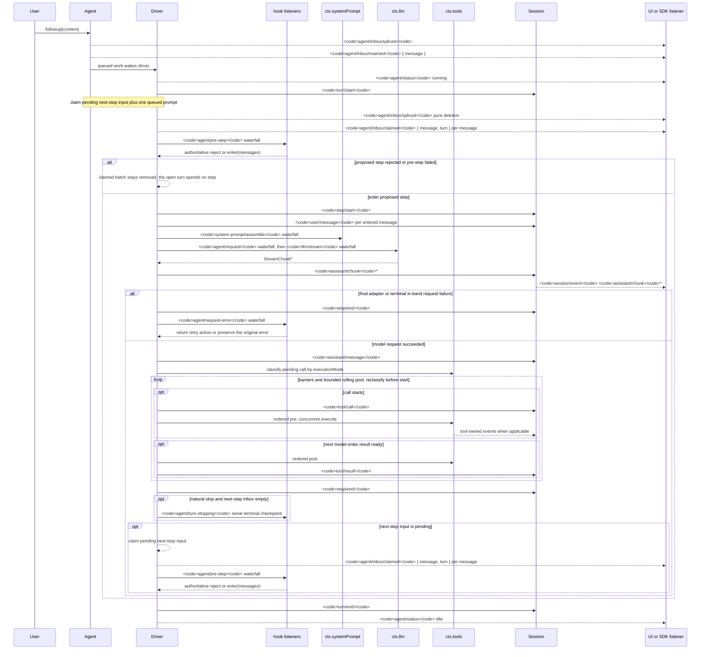

<!-- Generated by scripts/gen-doc-graphs.ts - do not edit by hand.
     Run `pnpm run gen-doc-graphs` to regenerate. -->

# Ciclo de vida del turno y el paso del agent

[English](agent-lifecycle.md) | Español

Esta secuencia es el acompañamiento visual de [architecture.md](architecture.es.md#turn-flow). Mantiene los hechos de replay durables en `session/event` y el control y el estado en vivo en `agent/*`.

El evento `assistant/message` registra cada llamada exitosa al provider, incluidas las terminaciones sin contenido y por `max-tokens`. El contenido vacío se mantiene fuera del historial derivado, mientras que el evento durable conserva el uso y `sourceEventSeqs` enumerando los eventos `assistant/chunk` exactos, incluida una lista vacía explícita.

`dsh-compaction-basic` usa `agent/pre-step` para la presión antes de la derivación de la solicitud y `agent/request-error` solo para el desbordamiento canónico de contexto. Una vez que cualquiera de los disparadores cualifica, la poda opcional de resultados de herramientas se ejecuta antes de la selección del resumen. La recuperación funciona entre el paso fallido cerrado y el cierre del turno fallido, y abre un turno de reintento nuevo solo cuando la poda o la síntesis avanzan la generación de reemplazo de la superficie; si no, el error de solicitud original sigue siendo autoritativo.

La decisión devuelta por `agent/pre-step` es autoritativa; los listeners que envuelven `next()` conservan los mensajes posteriores a menos que el reemplazo sea intencional. El steering (direccionamiento) y el contexto inyectado pasan por el mismo waterfall (cascada de eventos) después de que una operación de claim posterior tome su lote de siguiente paso.

Los usuarios del SDK que necesiten datos de transcript (transcripción) reproducibles deben consumir `session/event`; `agent/*` es la API de coordinación en vivo para cola/estado, interceptación de prompts, construcción de solicitudes, steering (direccionamiento), continuación y errores.

Modo de mantenimiento: secuencia Mermaid curada; las firmas exactas de los eventos viven en el catálogo de Cordis generado.
