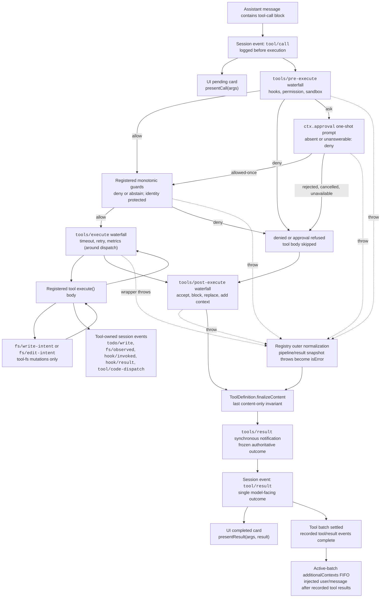

<!-- Generado por scripts/gen-doc-graphs.ts — no lo edites a mano.
     Ejecuta `pnpm run gen-doc-graphs` para regenerarlo. -->

# Pipeline de ejecución de herramientas

[English](tool-execution-pipeline.md) | Español

Este grafo muestra dónde se ejecutan las políticas, los hooks, el sandboxing, las salvaguardas del sistema de archivos, la reescritura de resultados, la observación del resultado final y el renderizado de la interfaz, sin modificar el loop. El waterfall (cascada de eventos) `tools/pre-execute` se ejecuta primero, después las salvaguardas monotónicas y a continuación los waterfalls `tools/execute` y `tools/post-execute`; los tres waterfalls pueden transformar una llamada. Después se ejecutan `finalizeContent` (propiedad de la definición) y `tools/result`.

Las comprobaciones de lectura-antes-de-edición del sistema de archivos permanecen por debajo de `tool-fs` en los eventos `fs/*`. Los waterfalls genéricos pre/post alojan hooks y la política de aprobación; `ctx.approval` resuelve las peticiones antes de las salvaguardas monotónicas, y la política del propietario que no debe reordenarse permanece como salvaguarda registrada. Las preocupaciones alrededor del dispatch, como los timeouts, envuelven `tools/execute`. El registro hace una instantánea sin pérdida del resultado candidato y normaliza un fallo de instantánea antes de que el callback `finalizeContent` (con instantánea) de la definición visible imponga su invariante síncrono de solo contenido. `tools/result` observa después el resultado inmutable en JSON sin pérdida. Esto permite que los hooks abarquen familias de herramientas sin acoplar las herramientas a un único servicio de política. Code Mode envía tanto el transporte reservado `run_code` como sus sub-llamadas serializadas a través del pipeline; las sub-llamadas llevan el token del padre, registran `tool/code-dispatch`, devuelven las denegaciones como rechazos vinculantes y omiten `additionalContexts` para preservar la adyacencia llamada/resultado.

Modo de mantenimiento: diagrama Mermaid curado; los schemas exactos de las herramientas y las firmas de los eventos viven en los catálogos generados.
